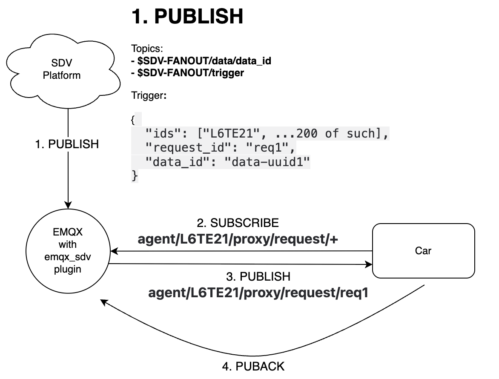

# EMQX SDV Fanout

This EMQX plugin is to implement message fanout for EMQ SDV platform.
The messages are published from SDV platform with a batch of VINs for each request (identified by a unique RequestID).

This plugin will receive the messages and store them in mnesia (rocksdb) tables.
Then it will fanout the messages to the corresponding VINs in a reactive manner.

## Data Format

The messages published from SDV platform are in JSON format with the following fields:

`ids`: Array of VINs
`request_id`: `task_{tasktype}_{per-type-number}`, per-type-number is finite. e.g. (1-10)
`data`: Transparent binary blob (maybe compressed) to be fanouted to the corresponding subscribers as MQTT message payload.

## Data Storage

The data is stored in two mnesia (rocksdb) tables.

`sdv_fanout_data`: Key is the `sha1` of the data, value is the timestamp and the binary data itself.
`sdv_fanout_ids`: Key is a composite key of `vin` and `request_id`, value is the timestamp and the `sha1` of the data.

### Compaction

If data has an existing `sha1` checksum in data table, no need to write again.

The 200 IDs in the original messages might be just a fraction of a larger batch, so the hashing will significantly reduce the amount of data to be written.

### Garbage collection

This plugin runs periodic garbage collection to delete `sdv_fanout_data` record if there is no reference left from `sdv_fanout_ids` table.

The `sdv_fanout_data` and `sdv_fanout_ids` table will be deleted if the timestamp is older than the configured retention period.

## Data Flow

This plugin starts a pool of dispatcher processes to fanout the data to the locally connected subscribers.

Below are the events which will trigger the fanout to the subscribers:

### Dispatch Triggers

- **Batch Received**:
   When a new batch is received, the publishing client will trigger the fanout data (and IDs) to be written to the database, then send notification to the dispatcher pool.  Depending on the session lookup result (pid), the notification `{maybe_send, new_batch, Pid, VIN}` should be sent to a dispatcher in the pool or an `rpc` call to a remote node to do the same.
- **Session Subscribed**:
  After a session is subscribed to `agent/${VIN}/proxy/request/+`, the plugin implemented callback (`'session.subscribed'`) should trigger a `{maybe_send, session_subscribed, Pid, VIN}` notification to the dispatcher pool.
- **Session Resumed**:
  For persisted sessions, the plugin implemented callback (`'session.resumed'`) should trigger a `{maybe_send, session_resumed, Pid, VIN}` notification to the dispatcher pool.
- **PUBACK Received**:
  When a `PUBACK` is received, the plugin implemented callback (`'delivery.completed'`) should delete the message ID from the `sdv_fanout_ids` table, and trigger a `{acknowledge, self(), RequestID}` notification to the dispatcher pool.
- **Heartbeat**:
  The vehicle periodically sends heartbeat to the EMQX using the topic `ecp/${VIN}/online`. The plugin implemented callback (`'message.publish'`) should trigger a `{maybe_send, heartbeat, Pid, VIN}` notification to the dispatcher pool. This is to ensure messages are sent to the vehicle even if other triggers missed due to race conditions. For example, after client session resume it may not observe the new batch being inserted in another node, and the new batch handler in the other node may not see the session being online, hence both nodes miss the opportunity to send the message. This heartbeat is to ensure the message is eventually sent.

### Dispatch Process

Each dispatcher process maintains a inflight state of the messages to be sent to the subscribers.

The inflight state is a ETS table of tuples of `{Pid, VIN, RequestID}`.

The dispatcher should call `emqx_cm:is_channel_connected/1` to check if the subscriber is currently online. Ignore the notification if the subscriber is not online.

If there is already a message in flight, the `maybe_send` notification will be ignored.

If there is no message in flight, the dispatcher will read the `sdv_fanout_ids` table to check if there is any message to be sent to the subscriber, if found, the dispatcher will send the message to the subscriber with QoS=1 topic = `agent/${VIN}/proxy/request/${request_id}`, monitor the subscriber process, and insert the sent message into the inflight table.

If a `'DOWN'` message is received from the subscriber, the dispatcher will remove the subscriber from the inflight table. The next `maybe_send` notification will be sent to the dispatcher pool after the subscriber is online again.

A special handling is needed for the `maybe_send` + `session_resumed` notification: if there is already a message in flight, the dispatcher should replace the old inflight message with the new Pid (and monitor the new Pid).
